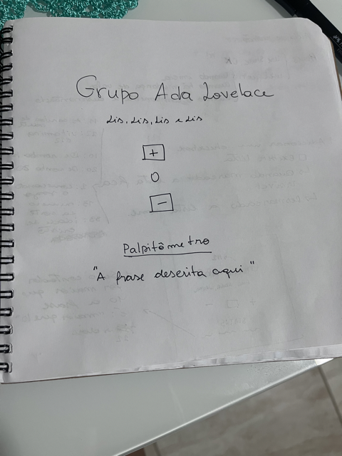

# Ciclo Formativo PretaLab | ReactJS - Aula 9 - 19/11 🚀

## ✓ Projeto III

### `Projeto da semana`

Crie um fork desse repositório e complete o código existente na pasta `contador-palpiteiro`, usando o useState e useEffect para que funcione da maneira desejada.

O Projetinho será um contador palpiteiro metido a orador de bingo, como na imagem abaixo:

A proposta é que sempre que o contador for modificado, através dos botões de + (soma) e - (subtração), o palpiteiro com base no valor do contador atualize sua frase.

# Palpites:

1. Numero 0: E tem zero no bingo é?
2. Numero 1: Hello World!
3. Numero 10: De romboooo..
4. Numero 11: As canelas de odete.
5. Numero 12: Vitamina B12
6. Numero 13: O melhor, o número da sorte!
7. Numero 22: Dois patinhos na lagoa
8. Numero 33: Idade de cristo
9. Qualquer outro número: Não sou capaz de opinar!

---

Feito com carinho por Lis :)

